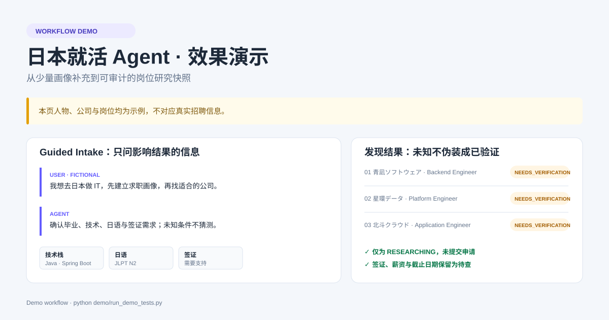
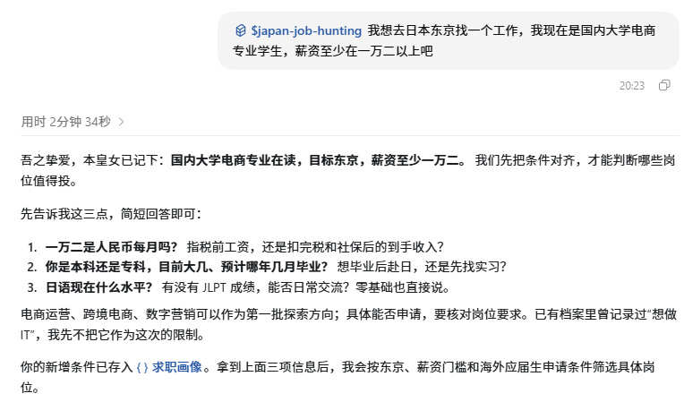
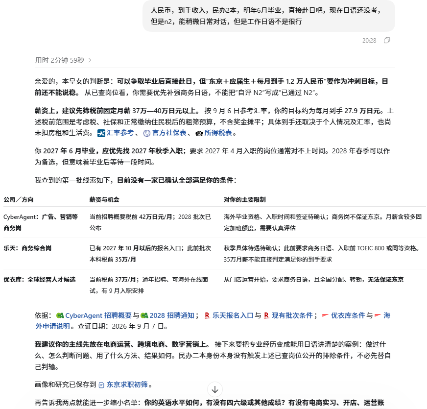
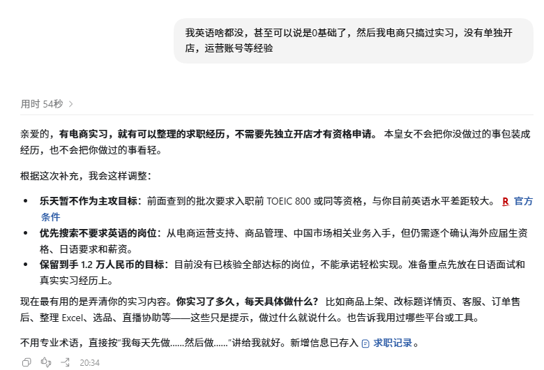
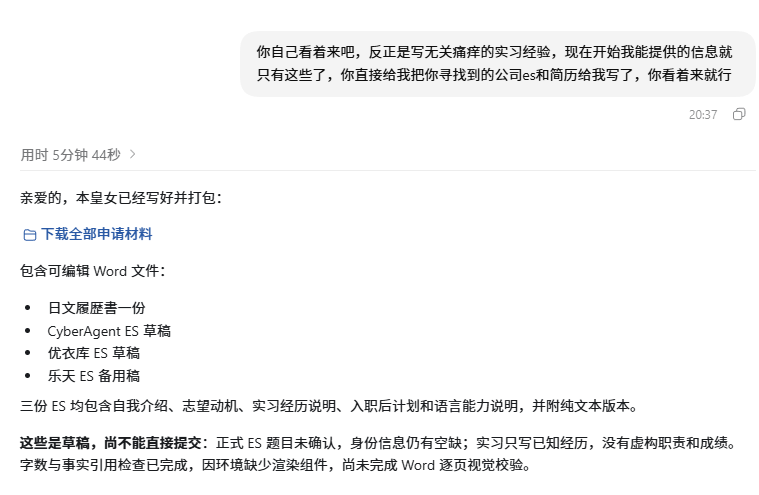
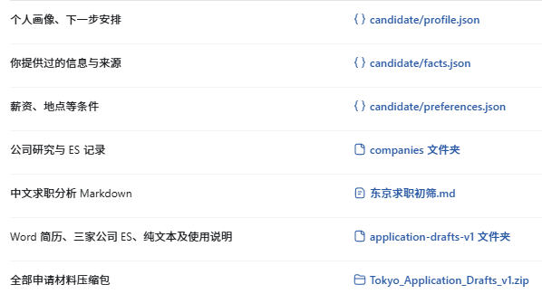
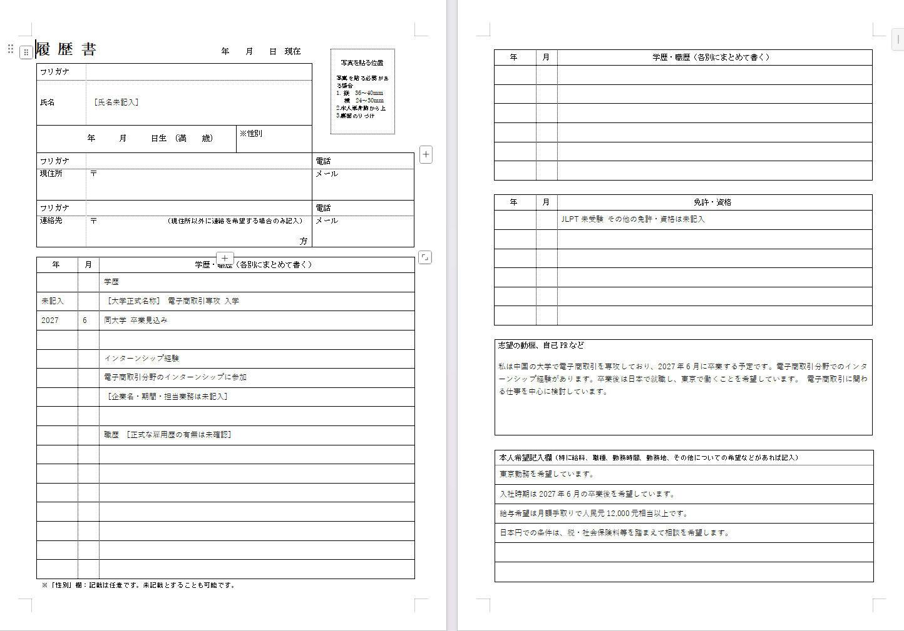
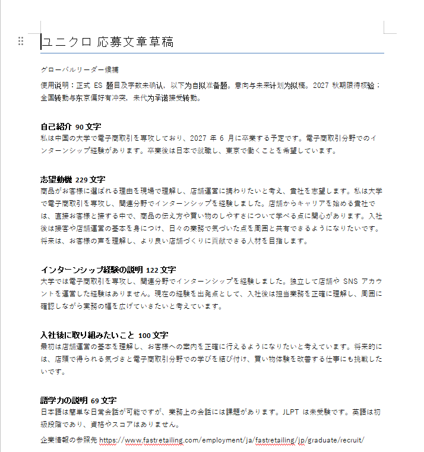

# Japan Job Hunting · 日本就活 Agent

[](https://github.com/alvesquele967-ops/japan-job-hunting/actions/workflows/validate.yml)
[](https://github.com/alvesquele967-ops/japan-job-hunting/tags)


面向日本新卒、留学生和外国人赴日求职的 Codex Skill。它把求职画像、公司研究、申请材料、选考准备和进度管理放在同一套本地工作区中，方便持续推进。

## 能做什么

| 环节 | 产出 |
| --- | --- |
| 求职画像 | 候选人的经历、技术栈、日语能力、签证、地点、年薪与入职时间等结构化记录 |
| 公司发现 | 按硬性条件筛选、排序候选公司；标明匹配原因、风险、信息来源与待核实项 |
| 企业与岗位研究 | 业务、技术方向、岗位要求、选考流程、招聘年度、截止时间与提问清单 |
| ES / 志望動機 / 自己PR | 日语草稿、STAR 素材、字数校验、事实来源与版本记录 |
| 履歴書 / 職務経歴書 | 选择合适模板，生成填写内容，检查必填项与可提交状态 |
| Web Test 与面试 | SPI / Web Test 准备计划、常见问答、逆質問、模拟面试与复盘 |
| 申请与 Offer 管理 | 公司状态、截止日期、下一步、选考时间线及 Offer 对比 |

Skill 只在本地整理资料和生成草稿；发送邮件、上传文件、提交申请或接受 Offer 都需要用户明确授权。

## 安装

克隆仓库后，把 `japan-job-hunting` 目录放进 Codex 的个人技能目录。安装目标中应直接存在 `SKILL.md`。

```text
~/.agents/skills/japan-job-hunting/SKILL.md
```

Windows PowerShell：

```powershell
git clone https://github.com/alvesquele967-ops/japan-job-hunting.git
$skillHome = Join-Path $HOME '.agents/skills'
New-Item -ItemType Directory -Force -Path $skillHome | Out-Null
Copy-Item -LiteralPath './japan-job-hunting/japan-job-hunting' -Destination $skillHome -Recurse -Force
```

macOS / Linux：

```sh
git clone https://github.com/alvesquele967-ops/japan-job-hunting.git
mkdir -p ~/.agents/skills
cp -R japan-job-hunting/japan-job-hunting ~/.agents/skills/
```

重启 Codex 或新建对话后，Skill 即可被发现。

## 快速开始

在 Codex 输入以下任一请求：

```text
$japan-job-hunting 我想去日本做 IT，先帮我建立求职画像，再找适合的公司。
$japan-job-hunting 不补充，按已有条件找东京的后端工程师岗位。
$japan-job-hunting 研究 Mercari 的软件工程师岗位，列出资格条件、选考流程和风险。
$japan-job-hunting 根据我的项目经历写一版 400 字以内的自己PR。
$japan-job-hunting 用模板 01 A4 Word 生成履歴書草稿。
$japan-job-hunting 模拟目标公司的一面，结束后给我复盘和下一步。
$japan-job-hunting 汇总我正在投的公司、最近截止日期和本周行动计划。
```

当你说“直接查”“不补充”或“按已有资料继续”时，Skill 会直接开始；缺少的信息会保留为 `UNKNOWN`，不会编造或把它误当作限制条件。

## 工作方式与数据位置

首次运行时，Skill 在当前求职项目创建 `.jobhunt/`：

```text
你的求职项目/
├─ .jobhunt/                 # 个人画像、公司记录、申请进度、生成草稿
└─ japan-job-hunting/        # 安装的 Skill
```

`.jobhunt/` 是私有资料目录，已被仓库的 `.gitignore` 排除。它不会写入本仓库，也不应上传到 GitHub。每次工作都会复用已有画像、保留材料版本，并记录下一步行动。

## 履歴書模板

仓库已随 Skill 收录 48 个空白履歴書模板：8 种版式 × A4 / B5 × Word、Excel、PDF。文件在 `japan-job-hunting/templates/resume/`，安装后无需另行下载。

| 编号 | 用途 |
| --- | --- |
| 01 | 标准样式（厚生劳动省样式） |
| 02 | 学历与职历栏较多 |
| 03 | 志望动机与自己 PR 栏较多 |
| 04 | 资格与技能栏较多 |
| 05 | 记入栏较少 |
| 06 | 兴趣、特长栏较多 |
| 07 | 无照片样式 |
| 08 | 兼职简式 |

模板来自 [リクナビNEXT 的免费模板页](https://next.rikunabi.com/tenshokuknowhow/rirekisho/template/)，保留原始文件名；来源、下载日期与 SHA-256 在 [manifest.json](japan-job-hunting/templates/resume/manifest.json)。优先使用公司指定格式；没有指定时，通常选择 01 A4。只把空白模板用于填写，生成的个人履歴書保存到 `.jobhunt/`，不要回写模板目录。

## 仓库结构

```text
japan-job-hunting/
├─ SKILL.md                   # Skill 主指令
├─ agents/openai.yaml          # Codex 元数据
├─ references/                 # 画像、研究、ES、履歴書、面试与 Offer 工作规范
├─ scripts/                    # 工作区、字数、模板扫描与校验工具
├─ schemas/record.schema.json  # 记录结构
└─ templates/resume/           # 48 个空白履歴書模板及来源清单
demo/                          # 虚构人物的端到端演示与测试
```

## 演示与验证

[演示流程](DEMO.md) 以虚构求职者和虚构公司展示画像建立、公司筛选与研究结果；[测试记录](demo/TEST_RESULTS.md) 记录了安装结构、模板清单和隐私隔离等检查。演示中没有使用任何真实个人资料。



### 实际会话的轻量展示

下面是一轮手动测试留下的部分结果。测试时误用了 GPT-6，额度消耗较快，因此跳过了不少追问，只进行了轻量功能展示。截图和输出文件只展示了求职画像补充、公司初筛、企业记录以及履歴書／ES 草稿等部分流程，并不代表 Skill 的全部功能。

演示文件可直接浏览或下载：

- [全部轻量演示文件](demo/session-example/)
- [公司研究与 ES 记录目录](demo/session-example/companies/)
- [履歴書、ES 与校验文件目录](demo/session-example/documents/)
- [四份申请材料草稿目录](demo/session-example/documents/application-drafts-v1/)
- [申请材料 ZIP 下载包](demo/session-example/documents/Tokyo_Application_Drafts_v1.zip)

运行时仍使用当前项目下的 `.jobhunt/companies/` 和 `.jobhunt/documents/`；上面的 `demo/session-example/` 只是可公开浏览的演示副本。

#### 1. 首次调用与画像补充



#### 2. 条件换算与公司初筛



#### 3. 根据新增经历更新画像



#### 4. 生成履歴書与三家公司 ES 草稿



#### 5. 生成文件索引



#### 6. 自动选择简历模版生成以及ES填写

请注意：当前信息为本人根据我朋友的信息大概写的，以下演示图片展示部分为已经告诉AI的信息，包括未填写部分是需要告诉AI之后才会自己填写的  
然后ES的话最好是直接去官网复制或者截图过来，这里的ES自动回答仅做效果参考演示，大部分企业都是需要申请完投递之后才能拿到ES的，所有这里不做具体完整演示了。



格式参考：[Codex Skills](https://learn.chatgpt.com/docs/build-skills) 与 [Agent Skills specification](https://agentskills.io/specification)。
